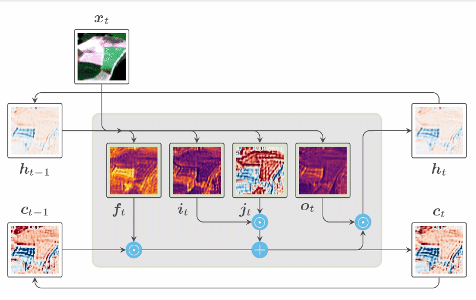
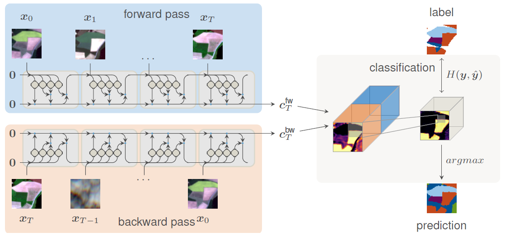

# Multitemporal Land Cover Classification Network

A recurrent neural network approach to encode multi-temporal data for land cover classification.

##### Source code of Rußwurm & Körner (2018) [PDF](http://www.mdpi.com/2220-9964/7/4/129)

If you use this repository consider citing
```
Rußwurm M., Körner M. (2018). Multi-Temporal Land Cover Classification with
Sequential Recurrent Encoders. ISPRS International Journal of Geo-Information, 7(4), 129..
```


The `Tensorflow 1.7` code of the network is located at `modelzoo/seqencmodel.py`
Further scripts for training and evaluation are provided.
Additionally, `Jupyter` notebooks used for accuracy evaluation and extraction of internal network activiations are located in this repo.
The code can be executed after downloading the demo data.
After installing the dependencies the python scripts should be executable.
Additionally, we provided a `docker` image with all dependencies already installed.
The code was developed in `Tensorflow 1.4` and was later ported to `Tensorflow 1.7`.

## Network

Similar to an encoding rnn layer of [sequence-to-sequence](https://www.tensorflow.org/tutorials/seq2seq) a variable-length input sequence of images is encoded to intermediate reprentation.

Encoding LSTM-RNN:
<p align="center">

</p>

Network structure
<p align="center">
  
</p>
Bidirectional rnn encoder and convolutional softmax classifier, as described in the paper.

## Dependencies

Implementations of ConvGRU and ConvLSTM forked from https://github.com/carlthome/tensorflow-convlstm-cell
```bash
git clone https://github.com/MarcCoru/tensorflow-convlstm-cell.git utils/convrnn
```

Python packages
```bash
conda install -y gdal
pip install tensorflow-gpu=1.4
pip install psycopg2
pip install configobj
pip install matplotlib
pip install pandas
pip install configparser
pip install Pillow # for activations.py
```

## Download demo data

download demo data (requirement to run the following commands)

```bash
bash download.sh
```

## Jupyter notebooks

```bash
# start notebook (required dependencies)
jupyter notebook

# within docker
nvidia-docker run -ti -v $PWD/data_IJGI18:/MTLCC/data_IJGI18 -p 8888:8888 marccoru/ijgi18 \
    jupyter notebook --ip 0.0.0.0 --allow-root --no-browser
```

## Network training and evaluation

### on local machine (requires dependencies installed)

#### build the network graph for 24px tiles
```bash
python modelzoo/seqencmodel.py \
    --modelfolder tmp/convgru128 \
    --convrnn_filters 128 \
    --convcell gru \
    --num_classes 17 \
    --pix10m 24
```

#### train the network graph
```bash
python train.py tmp/convgru128 \
    --datadir data_IJGI18/datasets/demo/240
    --temporal_samples 30 \
    --epochs 30 \
    --shuffle True \
    --batchsize 4
    --train_on 2016 2017
```

#### build network graph for 48px tiles
```bash
python modelzoo/seqencmodel.py \
    --modelfolder tmp/convgru128_48px \
    --convrnn_filters 128 \
    --convcell gru \
    --num_classes 17 \
    --pix10m 48
```

#### initialize the network and copy weights from 24px to 48 px networks
```bash
# initialize
python init_graph.py tmp/convgru128_48px/graph.meta

# optional: compare tensor dimensions of two graphs
python compare_graphs.py tmp/convgru128 tmp/convgru128_48px

# copy network weights from source (24px) network to target (48px) network
python copy_network_weights.py tmp/convgru128 tmp/convgru128_48px
```

#### evaluate the model
(writes prediction pngs and statistics on accuracy to `tmp/eval/24`)
```bash
python evaluate.py tmp/convgru128 \
    --datadir data_IJGI18/datasets/demo/240 \
    --storedir tmp/eval/24 \
    --writetiles \
    --writeconfidences \
    --batchsize 1 \
    --dataset 2017
```

### using docker image (requires nvidia-docker)

```bash
# alias for command: start nvidia-docker session and forward folders for data and models
alias dockercmd="nvidia-docker run -ti -v $PWD/data_IJGI18/datasets/demo:/data -v $PWD/tmp:/model -v $PWD/tmp:/output marccoru/ijgi18"

# create model
dockercmd python modelzoo/seqencmodel.py \
    --modelfolder /model/convgru128 \
    --convrnn_filters 128 \
    --convcell gru \
    --num_classes 17 \
    --pix10m 24

# start training
dockercmd python train.py /model/convgru128 \
    --datadir /data/240 \
    --temporal_samples 30 \
    --epochs 30 \
    --shuffle True \
    --batchsize 4 \
    -d 2016 2017

# evaluate
dockercmd python evaluate.py /model/convgru128 \
    --datadir /data/240 \
    --storedir /output \
    --writetiles \
    --writeconfidences \
    --batchsize 1 \
    --dataset 2017
```

## Extract Activations

`activations.py` is a scripted version from the activations section of `NetworkVisualization.ipynb`

to extract internal activation images from tile `16494` as pngs to `tmp/activations` folder run

```bash
python activations.py \
    data_IJGI18/models/convlstm256_48px/ \
    data_IJGI18/datasets/demo/480/ \
    tmp/activations \
    --dataset 2016 \
    --partition eval \
    --tile 16494
```

via docker
```bash
alias dockercmd="nvidia-docker run -ti -v $PWD/data_IJGI18/datasets/demo:/data -v $PWD/data_IJGI18/models:/models -v $PWD/tmp:/output marccoru/ijgi18"

dockercmd python activations.py \
    /models/convlstm256_48px/ \
    /data/480/ \
    /output/activations \
    --dataset 2016 \
    --partition eval \
    --tile 16494
```

## Customization

If you plan to customize this code with your data:
check out `SimpleTrain.ipynb`

This notebook provides a simplified walkthrough 
from the most important components implemented in this repo

it includes
1. the creation of a custom fake dataset in the right format
2. the parsing of this dataset
3. performing one training step on this dataset